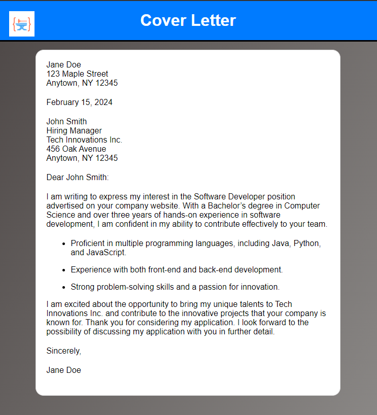

# Exercise: Add CSS to Cover Letter

In this exercise, we will take the cover letter HTML we created in the previous module and style it.

## Requirements

At minimum, please add the following features:

* **CSS Reset**: Be sure to reset the margin and padding of all elements as we've previously demonstrated.
* **HTML Style**: Set the HTML element style to be 100% height and add a gradient to the bottom right.
* **Header Bar**: Add a header with a logo and title text that is centered. Note that the logo will push the title text over slightly, so see if you can figure out how to account for that. The header bar should have a bottom border with appropriate thickness to be a separator.
* **Cover Letter**: Center the cover letter using percentage widths and add a rounded border. Be sure to space elements so that they look nice and indent any list items.

Feel free to use your own creative freedom and go further than these requirements. The goal here is to practice! Here is an example of a page that meets the minimum requirements:

