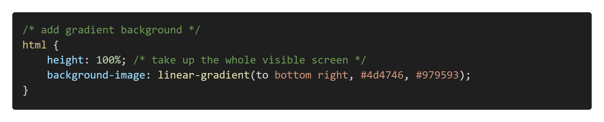
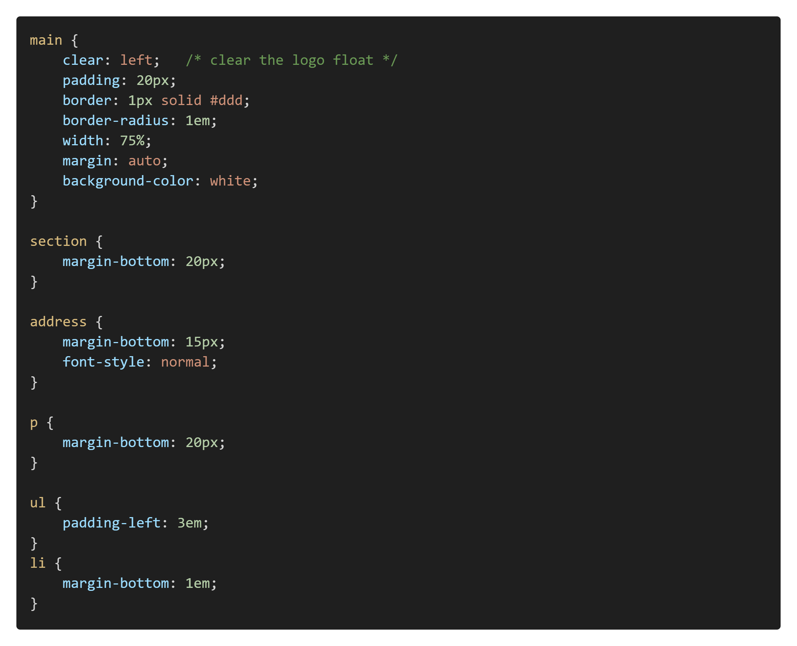

# Solution: Styling our Cover Letter

You can find our solution code in the **03-Intro-To-CSS\Exercises\CoverLetter2\Solution\\** folder. 

Per the requirements, we created some basic HTML styles.

**Reset the Spacing**

We used the * selector to reset the spacing on all elements:

**HTML Style**

By default, the **\<html>** element will not extend past the **\<body>**. By setting its **height** to 100%, we can differentiate between the body and document sizes. We also chose a gray linear gradient:

**Header Bar**

The logo we used was 50x50px and floated to the left. This means that it pushed the "Cover Letter" text slightly off-center. We fixed this with a negative margin on the image to "pull" the header text back to center:

If we hadn't reset the default margins, we would have had to account for them as part of the negative value.

**Cover Letter Elements**

Because of the logo float above, we needed to clear our **\<main>** element. Otherwise, it tried to pull that content up into the header area. To get the curved corners, we used the **border-radius** property and set the **width** to a percentage less than the screen width and a **margin** value of **auto** the body of the letter centered.

Additionally, we set the margins and padding on the letter elements to space them for easier reading.

## Conclusion

The solution we provided is the minimum for achieving the objectives. Be sure to experiment and try different views, layouts, and properties for a more interesting look and feel.