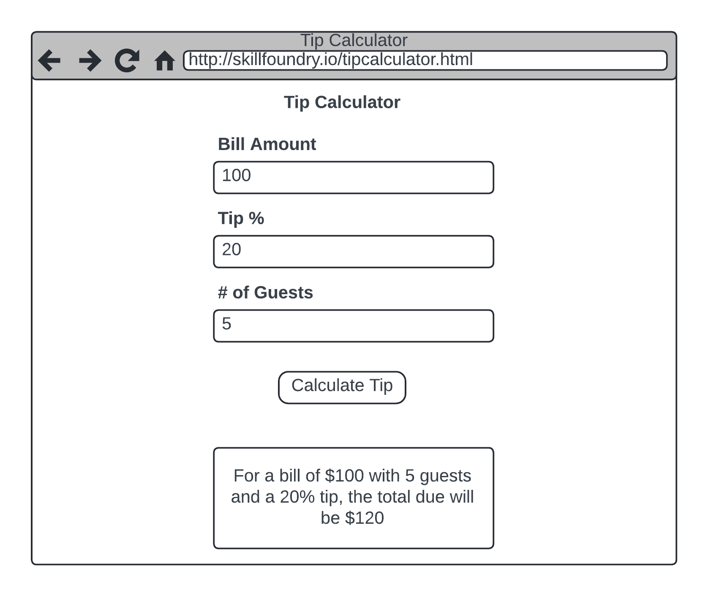

# Tip Calculator

In this project, we will create a simple tip calculator that allows users to enter the bill amount, tip percentage, and the number of guests. We will add custom logic to apply a 25% tip if the party size exceeds seven guests. Use the wireframe below while studying the requirements.

Below is a step-by-step video walkthrough. If you like, you can first attempt this practice exercise without the video and see how far you get. Otherwise, follow along with the video. The solution code is located in the **04-Intro-To-JavaScript\Examples\TipCalculator\\** folder.

## Requirements

Here are the requirements for this practice exercise:

**Layout**

- The header title should be centered.
- The three fields and the button should be contained in a **<form>** element.
- The form fields should not be excessively long at widescreen widths.

**Validation**

- All three fields should be numeric and required.
- The bill amount should have a minimum value of 0.
- The tip % should be in the range of 0 to 100.
- The number of guests should be in the range of 1 to 20.

**Behavior**

- If the number of guests exceeds 7, the tip percentage should be set to 25, and the field should be read-only.
- The user will fill out the tip percentage if the number of guests is 7 or less.
- The message box should not be visible until the button is pressed.
- The message box text should turn red for error messages. The calculation and error messages will be placed in the same element.

## Conclusion

The walkthrough showed how to approach a single-page problem by breaking down the requirements into small chunks and building and testing one part at a time. This leads to a better coding experience because as you build and test small pieces, you can ensure those parts work before moving on.

Many beginners try to do too much at once, get twisted up, and then struggle to complete project work. In the long run, practicing problem decomposition will make you more successful at coding.