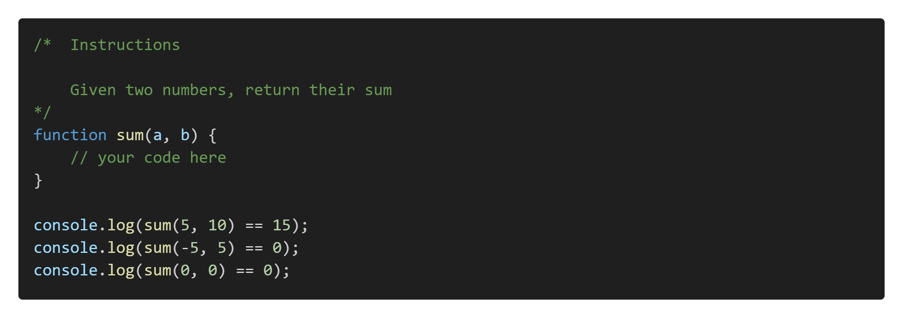
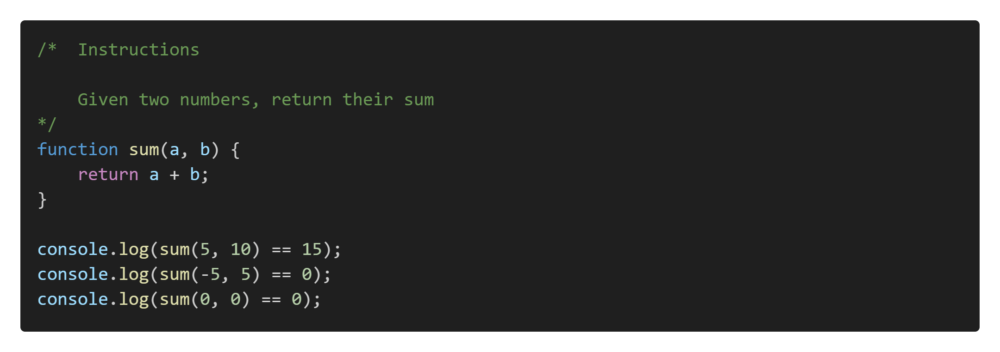
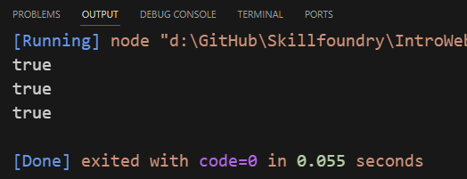

# Practice Exercise Instructions

Learning the fundamentals is important, and learning to code takes a lot of practice. With this in mind, let's work on some practice code in your editor. You will find several subfolders in the **\04-Intro-To-Javascript\Exercises\\** folder, one for each language feature we want to cover. The subfolders are:

* conditions
* loops
* arrays
* logic
* strings

Each subfolder has JavaScript files containing functions where you must write the code to pass the tests. In the root folder is a file named **01-sample.js**. Let's examine its contents:

The instructions in the comments are: "Given two numbers, return their sum". You can see in the function there is a comment: **// your code here**. Replace that comment with the code you need to complete the task. In this case, we would return the sum of **a** and **b**:

When you run the code, the **console.log()** statements invoke the function and check whether your code returns expected parameter values. If each of these log statements returns true:

Then, you have completed the exercise.

Good luck!