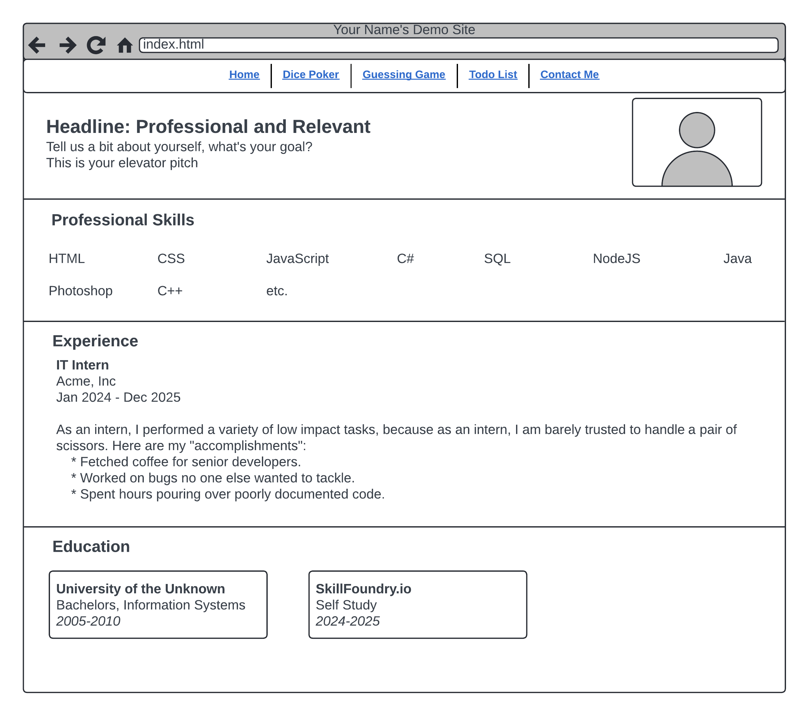

# Exercise: Creating Your Demo Site

This project is to build a personal portfolio website that will serve as a professional online presence to showcase your skills and projects. It should be aesthetically pleasing, responsive, and user-friendly. You may use a CSS Framework such as Bootstrap if you choose, but try to build some things without it. Or, if you have time, build one version of the site with Bootstrap and another version without.

## Wireframe

The site should have five pages, with three of them holding the other capstone project solutions. Here is a wireframe of the home page, which will serve as a profile page about you:

## Home Page

* Implement a clean and modern design with a professional color scheme.
* Ensure that the navigation bar and sections are responsive and that sections are either hidden or collapsed in a way that looks good on mobile phones.
* Add a favicon and either a logo, photo, or avatar to the header area.
* Use a Flexbox or Grid for the Professional Skills and Education sections. (If you use Bootstrap, you can still use these techniques)

## Contact Page

* Create a form that gathers information about the person filing the request (name, email, etc.) and has a text area for them to write their message.
* Validate the form fields appropriately for things like required fields, email format, and so forth. Show and hide error messages in a similar way to how we did it in our lessons.
* If you publish your site, be sure to note that the contact page is not wired up so that anyone who stumbles across it isn't disappointed!
* Also, include some social media links and logos on this page.
