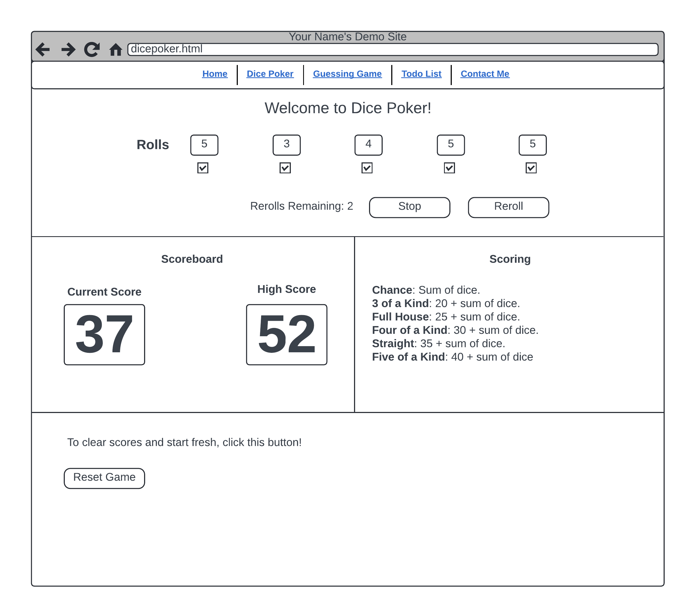

# Capstone: Dice Poker Game

Your task is to create a simplified, single-round dice poker game using HTML, CSS, and JavaScript. This game will allow one player to roll dice and attempt the best possible score from the scoring categories within a limited number of re-rolls.

## Game Components

1. **Dice Display:** Create five read-only text boxes aligned horizontally. These boxes will display the numbers the player rolls, representing the five dice of the game.
2. **Re-roll Selection:** Include a checkbox below each text box. This checkbox allows players to select which dice they want to re-roll. Think about how you'll use these to capture player choices for re-rolls.
3. **Control Buttons:**
   - **Reroll Button:** This button triggers a roll or re-roll of the selected dice. When clicked, it should only re-roll the dice marked by the checkboxes.
   - **Stop Button:** Allows players to end the round early, finalizing their score based on the current dice values.
   - **Reset Button**: Resets the game and begins a new round.
4. **Score Display:** Implement a section to display this session's current and best scores. This might include encouragement, the current state of the game, or the final score once the game has ended.
5. **Scoring Guide**: Provide some instruction on how scoring is calculated.

## Gameplay Logic

- **Initial Roll:** At the game start, all dice are rolled automatically to display an initial set of numbers.
- **Re-rolls:** Players can select which dice they wish to re-roll and then press the "Roll" button to roll those dice again.
- **Rounds**: There are a total of 3 rounds. The first round is automatically rolled.
- **Scoring:** Calculate the player's score every round.
- **Game End:** The game ends when the player clicks the "Stop" button or reaches maximum re-rolls. If necessary, update the high score for the session.

## Scoring Guidelines

1. **Chance:** Any combination of dice. Sum the total of the dice.
2. **Three-of-a-Kind:** If three dice show the same number, the score is 20 plus the total of all five dice.
3. **Full House**: If the roll includes three of one number and two of another, the score is 25 plus the sum of all five dice. For example, a roll of 2, 2, 3, 3, 3 constitutes a Full House and would be scored 25 + 2 + 2 + 3 + 3 + 3 = 38 points.
4. **Four-of-a-Kind**: If four dice show the same number, the score is 30 plus the sum of all the dice.
5. **Straight**: If the five dice show [1, 2, 3, 4, 5] or [2, 3, 4, 5, 6], then the score is 35 plus the sum of all the dice.
6. **Five-of-a-Kind**: If all five dice show the same number, the score is 40 plus the sum of all dice.

## Tips for Success

- **Start Simple:** Begin with the basic functionality of rolling dice and displaying the results. Then, gradually add features like re-roll logic, score calculation, and styling.
- **Debug Incrementally:** Regularly test and debug your code as you add new features to catch and fix issues early.
- **Don't Overcomplicate It:** If you ask Chat-GPT or the online community, you will find **many viable solutions** to problems in this exercise. We're not looking for the fanciest or most efficient solution. The goal is to use the basics.

## Wireframe

Here is one way this application could look. Don't be afraid to modify it if you like something else more!

