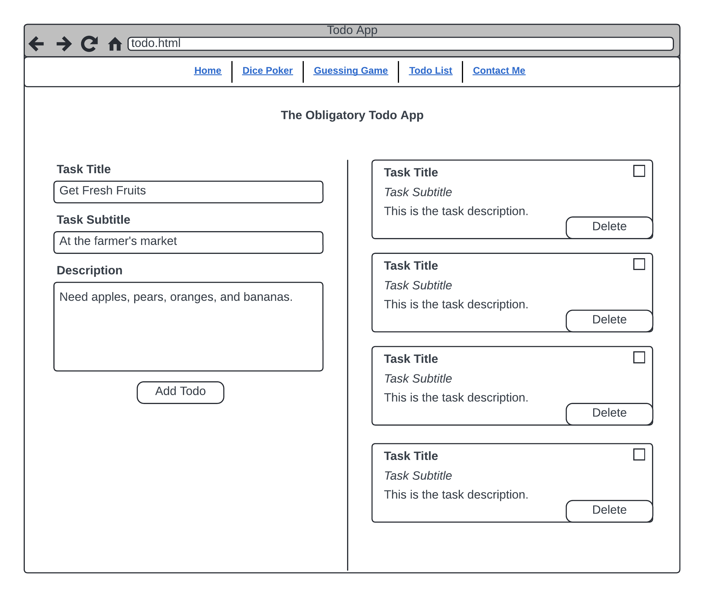

# Exercise: The Obligatory Todo App

Create an interactive Todo App that allows users to manage their tasks effectively. Users can add tasks with titles, optional subtitles, and descriptions. They can also mark tasks as complete and remove them from the list.

## Wireframe

Refer to this wireframe when reading the requirements:

## App Components & Requirements

1. **Task Input Fields**: Provide input fields for the Task Title, Task Subtitle (optional), and Description. Ensure that the Task Title is required before adding a task.
2. **Add Todo Button**: When clicked, this should add a new task to the list with the entered details. The input fields should be cleared after the task is added.
3. **Task List**: Each task in the list should show the Task Title, Subtitle (if provided), and Description. If the Subtitle is not provided, adjust the layout accordingly.
4. **Complete Checkbox**: Allow each task to be marked as complete with a checkbox. Once checked, the task should appear visually distinct (e.g., text strikethrough or light green background) to indicate its status.
5. **Delete Button**: Include a Delete button for each task. When clicked, the task should be removed from the list.

## Tips for Success

- **Start Simple**: First, create the form for adding tasks and make sure you can capture the input and log it to the console.
- **Add Tasks Dynamically**: Once the form input is working, focus on appending tasks to the task list dynamically.
- **Handle Empty States**: Implement the Delete functionality next, ensuring tasks can be removed. Also, ensure your app handles the case when no tasks are left on the list. You should show a message like "Yay! You have no tasks!" in the space.
- **Enhance Interaction**: After you've handled adding and removing tasks, work on the checkbox to mark tasks as complete, changing their style appropriately.
- **Iterate and Refine**: Build each piece individually and test thoroughly. Remember, your first job is to build a functioning app; refinement and additional features can come later.
- **Seek Simplicity**: While there are many possible enhancements, focus on meeting the base requirements first. It's better to have a simple, working application than a complex, broken one.